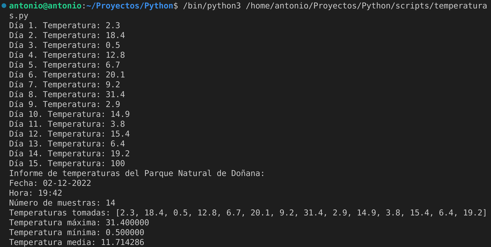

# Listas: Temperaturas

### a) Código comentado
```python
# Para obtener la fecha y hora actuales, importo la libreria datetime
from datetime import datetime

temperaturas = []
dia=1

# Bucle infinito hasta que escriba 100
while True:

    # Pregunto temperatura
    # Para sustituir variables en el texto se pone una plantilla (%d)
    # Luego se especifica al final qué variable se va a usar para la sustitución (dia)
    temp=float(input("Día %d. Temperatura: " % dia))
    # Si es 100, termino el bucle
    if temp == 100:
        break

    # Y la añado a temperaturas
    temperaturas.append(temp)

    # Aumento en 1 el día
    dia += 1

# Calculo el número de muestras. Número de posiciones que tiene la lista de temperaturas.
num_muestras = len(temperaturas)

# Calculo la fecha y hora actuales
fechaHora = datetime.now()

# Extraigo la fecha en el formato que necesito
fecha = fechaHora.strftime("%d-%m-%Y")

# Extraigo la hora en el formato que necesito
hora = fechaHora.strftime("%H:%M")

# Calculo media.
# Sumo todas las temperaturas (maximas y minimas) y divido entre numero de muestras x 2
# Multiplico por dos porque cada muestra tiene dos temperaturas (min y max).
media = sum(temperaturas) / num_muestras

# Imprimo informe
print("Informe de temperaturas del Parque Natural de Doñana:")
print("Fecha: %s" % fecha)
print("Hora: %s" % hora)
print("Número de muestras: %d" % num_muestras)
print("Temperaturas tomadas: %s" % temperaturas)
print("Temperatura máxima: %f" % max(temperaturas))
print("Temperatura mínima: %f" % min(temperaturas))
print("Temperatura media: %f" % media)

# Creo la tupla
tupla = (fecha, hora, temperaturas)

# Enviar la tupla a un fichero de texo.
# Abrir fichero en modo escritura (con w).
fw = open("temperaturas.txt", "w")

# Escribir la tupla.
# Se usa un separador (en este caso, coma y espacio ", ") y se une cada elemento de la tupla
# con join.
fw.write(", ".join([str(valor) for valor in tupla]))

#Cerrar fichero.
fw.close()
```

[Script temperaturas](scripts/temperaturas.py)

### b) Ejecución



`temperaturas.txt`
```
02-12-2022, 19:42, [2.3, 18.4, 0.5, 12.8, 6.7, 20.1, 9.2, 31.4, 2.9, 14.9, 3.8, 15.4, 6.4, 19.2]
```
